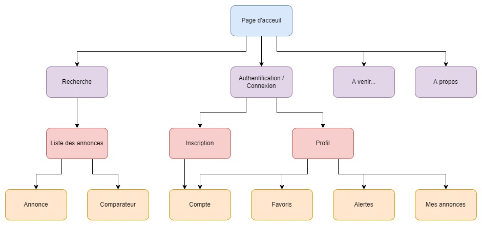

# Cahier des charges

## Sommaire
1. [Cadre du projet](#1-cadre-du-projet)
2. [Benchmark](#2-benchmark)
3. [Considérations marketing](#3-considérations-marketing)
4. [Conception graphique](#4-conception-graphique)
5. [Spécifications fonctionnelles](#5-spécifications-fonctionnelles)
6. [Spécifications techniques](#6-spécifications-techniques)
7. [Budget](#7-budget)

## 1. Cadre du projet
### 1.1. Résumé du projet
Le projet consiste à élaborer un site internet de diffusion d'annonces et de conseils immobiliers, dont les besoins principaux sont les suivants :
* Site web responsive et compatible avec tout type d'appareils
* Système d'authentification
* Affichage des annonces de vente et de location
* Système de filtrage sur les annonces
* Description unitaire des annonces
* Carte qui affiche les biens disponibles
* Prendre contact avec le vendeur
* Gestion des annonces (annonceur : ajout, suppression, modification | admin : ajout, suppression, modification)
* Gestion du compte (utilisateur : modification | admin : ajout, suppression, modification)
* Gestion des favoris (utilisateur : ajout, suppression)

### 1.2. Contexte
Le projet est réalisé dans le cadre du module _Systèmes d'informations Web_ de la formation **Ingénieur en Informatique, spécialité système d'information** au CNAM de Reims.

### 1.3. Enjeux et objectifs
L'objectif de ce projet est d'approfondir des compétences de gestion de projet digital, ainsi que d'acquérir de nouvelles compétences dans le développement d'applications web.

### 1.4. Equipe
Les différents acteurs de ce projet sont :
* Commanditaire : John DOE
* MOA : Maximilien CRUZ
* MOE : Mathieu TRITZ

### 1.5. Livrables
|Livrable|Date de rendu|
|:-|:-:|
|Cahier des charges fonctionnel et technique|10 avril|
|Maquettes du site|18 avril|
|Site internet responsive|29 mai|
|Soutenance|23 juin|

### 1.6. Planning prévisionnel

[
Lien vers le planning
](../planning.xlsx)

## 2. Benchmark
[SeLoger](https://www.seloger.com/)

<table>
<thead>
  <tr>
    <th>Points forts</th>
    <th>Points faibles</th>
  </tr>
</thead>
<tbody>
  <tr>
    <td>
    <li>Une IU globalement intuitive</li>
    <li>Un système de filtrage complet</li>
    <li>Le dépot d'annonce est bien accompagné</li>
    <li>Partage des favoris avec ses proches</li>
    <li>Fonctionnalité de like - dislike</li>
    <li>Les fonctionnalités liées à la carte sont très utiles</li>
    <li>Historique de prix des biens, avec évolution</li>
    <li>Beaucoup de conseils/astuces sur l'immobilier</li>
    <li>Plein de petites fonctionnalités, et de services complémentaires, intéressants</li>
    </td>
    <td>
    <li>L'affichage de la liste des annonces est trop minimaliste</li>
    <li>L'affichage des annonces est ordinaire</li>
    </td>
  </tr>
</tbody>
</table>

[BienIci](https://www.bienici.com/)

<table>
<thead>
  <tr>
    <th>Points forts</th>
    <th>Points faibles</th>
  </tr>
</thead>
<tbody>
  <tr>
    <td>
    <li>Le site est plutôt originale, très orienté virtuel</li>
    <li>La carte est ergonomique et agréable à utiliser</li>
    </td>
    <td>
    <li>Page principale trop chargée d'informations</li>
    <li>Le site en général n'est pas totalement intuitif</li>
    <li>La carte est trop présente et ralentit fortement la navigation sur le site</li>
    </td>
  </tr>
</tbody>
</table>

[Leboncoin](https://www.leboncoin.fr/)

<table>
<thead>
  <tr>
    <th>Points forts</th>
    <th>Points faibles</th>
  </tr>
</thead>
<tbody>
  <tr>
    <td>
    <li>Une IU simple d'utilisation</li>
    <li>Système de favoris et de recherche enregistrée simpliste</li>
    <li>Profil des annonceurs qui liste toutes leurs annonces</li>
    </td>
    <td>
    <li>La charte graphique est un peu vielliote</li>
    <li>Le système de filtrage est minimaliste</li>
    <li>Peu de fonctionnalités</li>
    <li>Les recommendations ne sont pas intéressantes</li>
    <li>L'affichage de la liste des annonces est trop minimaliste</li>
    </td>
  </tr>
</tbody>
</table>

## 3. Considérations marketing
### 3.1. Référencement
Le site respecte les [80 bonnes pratiques SEO du référentiel OPQUAST](https://checklists.opquast.com/seo/).

### 3.2. Cibles principales
<table>
<thead>
  <tr style="background-color:rgba(75,75,75,.5);">
    <th>Caractéristiques socio-démographiques</th>
    <th>Caractéristiques comportementales</th>
  </tr>
</thead>
<tbody>
  <tr>
    <td>
      <li>Origine : Français principalement</li>
      <li>Age : entre 18 et 50 ans</li>
      <li>Situation professionnel : En activité (CDI, CDD, Etudiant)</li>
    </td>
    <td>
      <li>Archetype : H/F</li>
      <li>Motivation : Acquisition d'un bien immobilier</li>
      <li>Critère de séléction : bonne description des annonces</li>
    </td>
  </tr>
</tbody>
</table>

## 4. Conception graphique
### 4.1. Brief créatif

### 4.2. Charte graphique
Palette de couleur :

Typographie de branding et de titre :

Typographie de contenu :

Design graphique :

## 5. Spécifications fonctionnelles
### 5.1. Périmètre fonctionnel

#### 5.1.1. Front office
|Fonctionnalités|Contraintes|
|-|-|
|Inscription|Captcha|
|Consulter les annonces||
|Prendre contact|Anti-spam|
|Sauvegarder les annonces|Contrôlable|
|Activer reporting|Contrôlable|
|Google Maps||

#### 5.1.2. Back office
|Fonctionnalités|Contraintes|
|-|-|
|Gestion des annonces||
|Gestion des comptes||
|Gestion des contenus||

### 5.2. Arborescence

### 5.3. Aperçu des contenus

## 6. Spécifications techniques
### 6.1. Choix des technologies
**Frameworks front-end** : Django templates / Sass / Bootstrap / jQuery (ou ReactJs)\
**Frameworks back-end** : Django, Nginx, Gunicorn\
**Database** : PostgreSQL / MinIO\
**SCM/VCS** : Git + Github\
**CI** :\
**Build** : Docker\
**Database Management** : pgAdmin\
**Testing** : pyUnit / pyTest / unittest\
**Deployment** :\
**Config Management/Provisioning** : \
**Artefact Management** : PyPI (pip) / DockerHub\
**PaaS** : Heroku (ou Dokku ou OpenShift)\

### 6.2. Accessibilité
#### 6.2.1. Compatibilité navigateur
Le site sera compatible avec les navigateurs suivants :  
* Internet Explorer
* Mozilla Firefox
* Google Chrome
* Safari
* Opéra

#### 6.2.2. Types d’appareils
Le site sera conçu de manière dite “responsive” pour qu’il assure une navigation optimale sur tous types d’appareils :
* Téléphones mobiles
* Tablettes
* Ordinateur portables
* Ordinateur de bureau

### 6.3. Service tiers
Google Maps

### 6.4. Sécurité
Pour assurer une protection contre les attaques externes, la sécurité contre les menaces suivantes sera mise en place :
* Injection (SQL principalement)
* Cross-site scripting (XSS)
* Attaque par déni de service (DoS)
* Attaque par déni de service distribué (DDoS)
* Cassage de mot de passe

### 6.5. Maintenance et évolutions
La maintenance du site internet sera assurée par le chef de projet, conformément au [contrat annuel de maintenance et d’assistance](https://creation-site-internet.ooreka.fr/ebibliotheque/voir/246106/contrat-de-maintenance-de-logiciel-ou-de-site-web).

## 7. Budget
Estimation des coûts pour un client potentiel :
<table>
<thead>
  <tr style="background-color:rgba(50,50,50,.9);">
    <th>Quantité</th>
    <th>Description</th>
    <th>Coût</th>
    <th>Remise</th>
  </tr>
</thead>
<tbody>
  <tr>
    <td> 1 </td>
    <td> Création d'un site internet responsive </td>
    <td> - </td>
    <td> - </td>
  </tr>
  <tr>
    <td> 1 </td>
    <td> - </td>
    <td> - </td>
    <td> - </td>
  </tr>
  <tr>
    <td> 1 </td>
    <td> - </td>
    <td> - </td>
    <td> - </td>
  </tr>
  <tr>
    <td> 1 </td>
    <td> Référencement </td>
    <td> - </td>
    <td> 450€ </td>
  </tr>
  <tr>
    <td> 1 </td>
    <td> Contrat de maintenance et d'assistance (abonnement annuel) </td>
    <td> - </td>
    <td> 800€ </td>
  </tr>
  <tr>
    <td> 1 </td>
    <td> Intégration d'annonces existantes </td>
    <td> 250€ </td>
    <td> 250€ </td>
  </tr>
  <tr style="background-color:rgba(150,150,150,.2)">
    <th colspan="5""></th>
  </tr>
  <tr>
    <td colspan="2"> Total </td>
    <td colspan="2"> 10 000€ </td>
  </tr>
</tbody>
</table>
